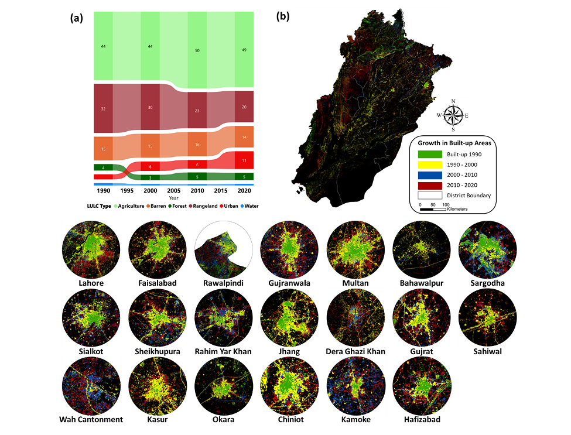

## Leveraging cloud-based computing and spatial modeling approaches for land surface temperature disparities in response to land cover change: Evidence from Pakistan

Hi, Welcome to this repo!
Here you will find various supporting materials for Waleed & Sajjad (2022) paper including:

    1. GEE Javascript based interactive Apps
    2. Pdf version of paper
    3. Streamlit based Geemap App codes
    4. Jupyter Notebooks for interactive visualization of results

Citation
========

If you find this work usefull in any way, don't forget to cite: 
    
    Waleed, M., & Sajjad, M. (2022). Leveraging cloud-based computing and spatial modeling approaches for land surface temperature disparities in response to land cover change: Evidence from Pakistan. Remote Sensing Applications: Society and Environment, 25, 100665.

**DOI:** https://doi.org/10.1016/j.rsase.2021.100665

**Paper pdf:** [Waleed & Sajjad (2022)][waleed2021]

# Abstract

 Monitoring spatial-temporal land use land cover (LULC) patterns and related processes (e.g., land surface temperature—LST) is essential to sustainable development at local, regional, and national levels. In this context, the present study leverages cloud-computing-based Google Earth Engine and geo-information modelling techniques to provide spatial-temporal insights regarding LULC and LST over the past three decades (1990–2020) in Pakistan—a south Asian country with ∼212 million people. Additionally, using Punjab province (the most populous and developed in Pakistan) as the study area, we empirically evaluate the association between several LULC types (i.e., built-up, forests, agriculture, rangeland, barren, and water) and LST. Our results show that due to the transition from rangeland and agriculture LULC to built-up areas (contributing 38 and 37%, respectively), ∼250% increase is observed in the impervious surface in Punjab during 1990–2020. While the rapid urbanization has resulted in ∼8.5 percent annual increase in built-up area during the study period, the highest percent change (∼10.5%) occurred during the most recent decade (i.e., 2010–2020). This increase in built-up areas has led to LST rise with 1.4 °C increase in maximum annual LST in Punjab. In addition, among the evaluated top-20 cities, the most significant rise in LST is observed by Kasur city followed by Chiniot, Sheikhupura, Sahiwal, and Lahore—areas known for industrial development in Pakistan. While the results on LULC provide important references for rational and optimal utilization of land resource via policy implications, the association between LULC and LST ascertains why it is critical to design sustainable LULC planning and management practices for climate change mitigation and adaptation. 

GEE (JavaScript) based Applications
============================

## App No. 1: Land-use maps visualization using 4-SplitMaps

The app contains visualization of land use land cover (LULC) for years 1990, 2000, 2010, and 2020. Although the app is prepared primarily to visualize the LULC for Punjab, we have planned to add functionality to this app in future (i.e. adding zonal statistics based on districts/divisions and change analysis)

- Click here to see the GEE based app: [4SplitMaps](https://waleedgis.users.earthengine.app/view/pululcapp24splitmaps)

How to use this data in your research
===========================================

For all the aformentioned resources (apps & notebooks), you can find in Resources folder. You can clone this repo using `Git`. For that, run this code in terminal 

    git clone https://github.com/waleed-gis/PU-Waleed2021

Then navigate into main folder using:

    cd PU-Waleed2021

You can clone, and use provided materials with your modifications. 

For specific data such as 
1) LULC Classification Codes
2) LULC training and validation samples
3) LULC rasters
4) LST rasters
5) Statistical analysis 

Please contact authors directly with reasonable request.

Acknowledgements
================

- This repository is prepared to publish the results of [Waleed & Sajjad (2022)][waleed2021] in the form of GEE based interactive applications.

- No specific funding was provided for this research.

Contributors
============

- ### Mirza Waleed [][Gmail]&nbsp; [][Google Scholar]&nbsp; [][LinkedIn]&nbsp; [][ResearchGate]&nbsp; [][orcid]&nbsp;

- ### Muhammad Sajjad [][Gmail1]&nbsp; [][Google Scholar1]&nbsp; [][LinkedIn1]&nbsp; [][ResearchGate1]&nbsp; [][orcid1]&nbsp;

[Google Scholar]: https://scholar.google.com/citations?user=mx4VhG4AAAAJ&hl=en
[LinkedIn]: https://www.linkedin.com/in/mirzawaleed197
[ResearchGate]: https://www.researchgate.net/profile/Mirza-Waleed
[orcid]: https://orcid.org/0000-0003-0006-2490
[Gmail]: mailto:mirzawaleed197@gmail.com

[waleed2021]: https://drive.google.com/file/d/15S7TzBYdyYUBULQ9UUQ6ngeI-G6fhRTx/view?usp=sharing

[Google Scholar1]: https://scholar.google.com/citations?user=iuXamUEAAAAJ&hl=en
[LinkedIn1]: https://www.linkedin.com/in/muhammad-sajjad-ph-d-05590865/
[ResearchGate1]: https://www.researchgate.net/profile/Muhammad-Sajjad-4
[orcid1]: https://orcid.org/0000-0002-1576-1342
[Gmail1]: mailto:mah.sajjad@hotmail.com
